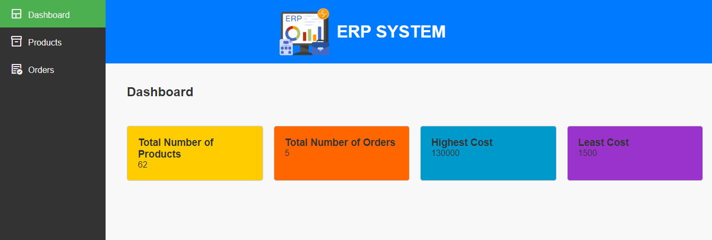
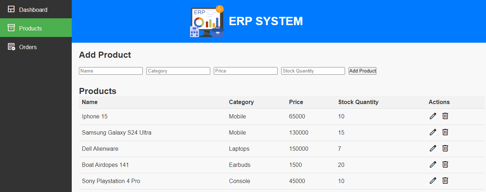
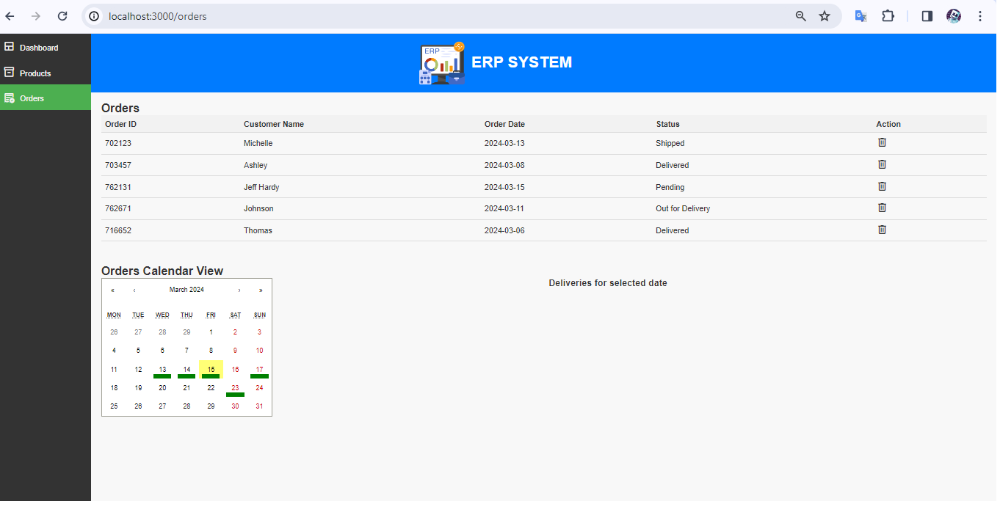

# React ERP System

## Introduction
React ERP System is a web application designed to streamline enterprise resource planning (ERP) processes for businesses. It provides a user-friendly interface for managing various aspects of business operations, including inventory management, order processing, and customer relationship management (CRM).

## Installation
To run the application locally, follow these steps:

1. Clone the repository: 
2. Navigate to the project directory: `cd erp-react`
3. Install dependencies: `npm install`
4. Chart.js version: npm install --save-dev chart.js@^4.1.1

## Usage
To start the development server, run: `npm start`
Open [http://localhost:3000](http://localhost:3000) to view the application in your browser.

## Folder Structure
- `/src`: Contains the source code for the application.
  - `/components`: Contains React components.
- `/public`: Contains static assets and the index.html file.
- `README.md`: Documentation file.
- `package.json`: Configuration file for npm dependencies.

## Components 
- Dashboard.js : Responsible for Dashboard page which shows all the key metrics and summary of the features
- Header.js    : Responsible for Header component of the application which holds the company name and logo
- ProductForm.js :Responsible for Adding new products into the database.The product will be added only if all the required fields are filled in the input form.
- ProductList.js : Responsible for Editing, Updating, and Deleting the products from the database
- ProductManagement.js : Responsible for displaying the products in the form of a table which displays the columns like product name , category , stock quantity, price etc.
- OrdersList.js : Responsible for deleting and updating the status of the orders.
- OrdersCalendar.js : Responsible for showing the expected delivery dates of the orders listed and can be used as filter.
- OrdersManagement.js : Responsible for displaying the orders in the form of table where we can delete the orders and update its status to pending or delivered. 

## Technologies Used
- React.js
- CSS
- HTML
- npm

## Features
- Dashboard: View key metrics and insights about the business. This page displays the key metrics and summary in the form of metric cards. We can also add insightful charts to the dashboard using chart.js
- Products Management: Add, edit, and delete products from the inventory.
- Orders Management: Process and manage customer orders efficiently.

## Screenshots
Here are some sample screenshots of the application:

### Dashboard

### Products Management

### Orders Management

## Deployment
The application can be deployed to any hosting service. Follow these steps:
1. Build the project: `npm run build`

## Acknowledgements
- Material Icons: Used for iconography.
- React Router: Used for client-side routing.
- Bootstrap: Used for responsive design.
